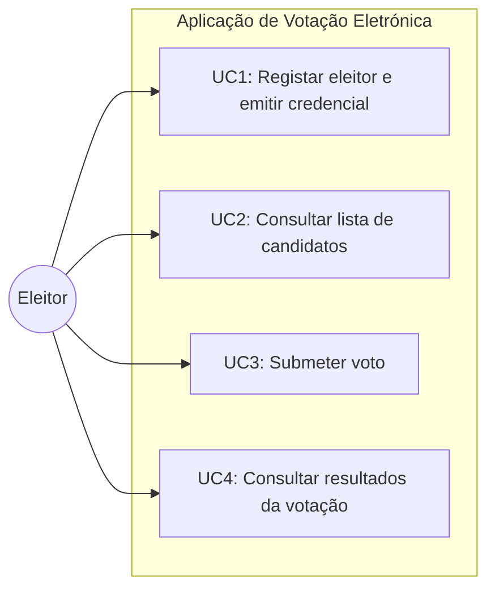

# VotingSystem-App



Protótipo de aplicação de votação eletrónica que consome serviços gRPC remotos e expõe um backend REST (orquestração) + frontend web estático, seguindo um processo em três fases:
1) Registo (emissão de credencial)
2) Votação (submissão de voto com credencial)
3) Apuramento (consulta de resultados agregados)

## Nota sobre a demonstração online (andremaciel.pt/IS2026)
A página publicada em `https://andremaciel.pt/IS2026/` é uma **interface demonstrativa**.  
O protótipo completo requer execução local do backend devido a limitações técnicas do alojamento (ausência de reverse proxy e de suporte a processos persistentes) e a restrições do browser para chamadas HTTP a partir de páginas HTTPS (mixed content).  
O procedimento completo de teste encontra-se abaixo.

---

## Requisitos (execução local)
- Windows + PowerShell
- Python 3.11 (recomendado) instalado
- `grpcurl` instalado e acessível no PATH (necessário para o backend, que usa grpcurl como mitigação técnica para TLS do endpoint remoto)
- Acesso à Internet (para contactar os serviços remotos)

> Nota: o frontend é estático e pode ser servido por `python -m http.server`.

---

## Estrutura do projeto
- `backend/` — API REST (FastAPI) que consome os serviços gRPC remotos
- `site/` — frontend estático (HTML + JS)

---

## 1) Executar o backend (FastAPI)

### 1.1 Criar e ativar ambiente virtual
```powershell
cd .\backend
py -3.11 -m venv .venv
.\.venv\Scripts\Activate.ps1
```

### 1.2 Instalar dependências
```powershell
python -m pip install --upgrade pip
python -m pip install -r requirements.txt

```

### 1.3 Arrancar o backend
```powershell
python -m uvicorn app.main:app --host 127.0.0.1 --port 8000

```

### 1.4 Testes rápidos ao backend (PowerShell)
Numa nova janela PowerShell:
```powershell
curl http://127.0.0.1:8000/health
curl http://127.0.0.1:8000/candidates
curl -Method POST http://127.0.0.1:8000/register -ContentType "application/json" -Body '{"citizen_card_number":"123456789"}'

```

## 2) Executar o frontend (site)
Numa nova janela PowerShell:
```powershell
cd .\site
py -m http.server 5500

```
Abrir no browser: http://127.0.0.1:5500

## 3) Teste funcional completo (via browser)

### 3.1 Registo

Introduzir um número de Cartão de Cidadão (mock)

Clicar em “Obter credencial”

Se "is_eligible=false", repetir com outro número até obter credencial

### 3.2 Votação

Clicar em “Carregar candidatos”

Selecionar um candidato

Clicar em “Submeter voto”

Confirmar mensagem de sucesso

### 3.3 Apuramento

Clicar em “Obter resultados”

Verificar tabela com votos agregados

### 3.4 Robustez (bloqueio local)

Após um voto aceite, repetir a submissão com a mesma credencial:

o frontend/back-end devem bloquear nova submissão na mesma sessão, preservando a coerência do protótipo.

## 4) Observações técnicas relevantes

O backend utiliza grpcurl como mitigação pragmática para limitações TLS do endpoint remoto (certificado sem SAN/hostname válido), mantendo o fluxo de teste exigido.

O backend aplica CORS para permitir consumo do frontend em origem diferente durante o desenvolvimento local.

A credencial de votação é utilizada na fase de voto sem associação à identidade do eleitor, alinhada com o princípio do anonimato do voto.

--- 

# Testes necessários para reconfirmar que está tudo OK (local)

## A) Backend (PowerShell)

1) **Health**
```powershell
curl http://127.0.0.1:8000/health
```

✅ Esperado: {"status":"ok"}

2) **Candidatos**

```powershell
curl http://127.0.0.1:8000/candidates
```
✅ Esperado: lista de candidatos

3) **Registo (até sair elegível)**
```powershell
curl -Method POST http://127.0.0.1:8000/register -ContentType "application/json" -Body '{"citizen_card_number":"706782478"}'
```
✅ Esperado: quando for elegível -> credencial CRED-...

4) **Votar**
```powershell
curl -Method POST http://127.0.0.1:8000/vote -ContentType "application/json" -Body '{"voting_credential":"CRED-ABC-123","candidate_id":2}'
```
✅ Esperado: success:true

5) **Resultados**
```powershell
curl http://127.0.0.1:8000/results
```
✅ Esperado: tabela/array com votos

6) **Bloqueio local (tentar votar novamente com a mesma credencial)**
```powershell
curl -Method POST http://127.0.0.1:8000/vote -ContentType "application/json" -Body '{"voting_credential":"CRED-ABC-123","candidate_id":2}'
```
✅ Esperado: erro do backend indicando bloqueio local da credencial.


## B) Frontend (browser)

1. abrir http://127.0.0.1:5500

2. registar até ter credencial

3. carregar candidatos

4. votar

5. obter resultados

6. tentar votar novamente → deve ser bloqueado (UI + backend)

---

Referências bibliográficas (ABNT)

* FIELDING, Roy Thomas. Architectural styles and the design of network-based software architectures. 2000. Tese (Doutoramento em Ciência da Computação) – University of California, Irvine, Irvine, 2000.
* FASTAPI. FastAPI Documentation. [S. l.], s. d. Disponível em: https://fastapi.tiangolo.com. Acesso em: 27 jan. 2026.
* GOOGLE. Protocol Buffers: JSON Mapping. [S. l.], s. d. Disponível em: https://protobuf.dev/programming-guides/proto3/#json. Acesso em: 14 jan. 2026.
* GRPCURL. gRPCurl: A command-line tool for interacting with gRPC servers. [S. l.], s. d. Disponível em: https://github.com/fullstorydev/grpcurl. Acesso em: 21 jan. 2026.
* MAHMOOD, Zaigham. Service-oriented architecture: potential benefits and challenges. In: WSEAS International Conference on Computers, 11., 2007, Agios Nikolaos. Proceedings […]. Agios Nikolaos: WSEAS Press, 2007.
* MDN WEB DOCS. Mixed content. [S. l.], s. d. Disponível em: https://developer.mozilla.org/en-US/docs/Web/Security/Mixed_content. Acesso em: 19 jan. 2026.
* NIKNEJAD, Naghmeh et al. Understanding service-oriented architecture (SOA): a systematic literature review and directions for further investigation. Information Systems, v. 91, p. 101491, 2020.
* RUH, William A.; MAGINNIS, Francis X.; BROWN, William J. Enterprise application integration: a Wiley tech brief. New York: John Wiley & Sons, 2001.
* UNIVERSIDADE DE TRÁS-OS-MONTES E ALTO DOURO. Voting system: enunciado e especificações do processo e dos serviços gRPC. Vila Real: UTAD, 2025.

